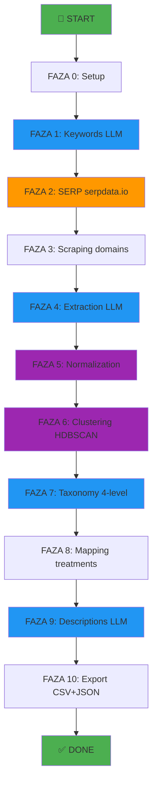

# 🔄 Pipeline Diagram - Wizualizacja procesu

## 🎯 High-Level Overview

```
Keywords → SERP → Domains → Scraping → Extraction → Normalization → 
Clustering → Taxonomy → Mapping → Descriptions → Export
```

---

## 📊 Szczegółowy flow (10 faz)



---

## 🔍 Szczegóły każdej fazy

### **FAZA 0: Setup**
```
Input:  API keys (OpenRouter, SerpData, Jina)
Output: Configured environment
Time:   ~1 second
Cost:   $0
```

**Kroki**:
1. Install packages
2. Load API keys
3. Initialize OpenRouter client
4. Setup helpers (clean_text, embed_texts, etc.)

---

### **FAZA 1: Keywords (LLM)**
```
Input:  MAX_KEYWORDS (default: 20)
Output: phase1_keywords.csv
Time:   ~10-30 seconds
Cost:   ~$0.05
```

**Flow**:
```
LLM prompt → Generate keywords → Deduplicate → Save CSV
```

**Przykład output**:
```
mezoterapia igłowa twarzy
botoks bruksizm
liposukcja brzucha
rinoplastyka nos
peeling kwasowy twarz
```

---

### **FAZA 2: SERP → Domains**
```
Input:  phase1_keywords.csv
Output: phase2_serp_keyword_url.csv
        phase2_unique_urls.csv
        domains.csv
Time:   ~2-5 minutes (20 keywords × 10 URLs × 2s sleep)
Cost:   ~$0.50 (20 × $0.025)
```

**Flow**:
```
For each keyword:
  → SerpData API → Top 10 URLs → Extract domain → Filter clinics
```

**Domain filtering**:
```python
BAD = ["facebook", "instagram", "booksy", "znanylekarz", ...]
GOOD = ["klinika", "clinic", "med", "derma", "laser", ...]
```

---

### **FAZA 3: Scraping**
```
Input:  domains.csv (50 domains)
        phase2_unique_urls.csv
Output: phase3_scraped_content.csv
Time:   ~10-20 minutes (50 domains × 12 pages × 0.5s)
Cost:   $0 (free scraping)
```

**Flow**:
```
For each domain:
  → Get URLs (max 12 pages)
  → For each URL:
      → BeautifulSoup scrape
      → Extract clean text
  → Combine all texts (max 50k chars)
```

**Challenges**:
- Rate limiting (0.5s sleep between pages)
- Timeouts (15s timeout per page)
- Failed scrapes (try/except)

---

### **FAZA 4: Extraction (LLM)**
```
Input:  phase3_scraped_content.csv
Output: phase4_raw_treatments.csv
Time:   ~10-20 minutes (50 domains × 0.3s)
Cost:   ~$1-2
```

**Flow**:
```
For each domain text:
  → LLM: Extract treatment names
  → Parse response (split by newline)
  → Initial dedup (norm_key)
```

**LLM Prompt**:
```
Wypisz WSZYSTKIE nazwy zabiegów medycyny estetycznej z tekstu.
- Jedna nazwa w jednej linii
- Bez marek urządzeń
- Tylko konkretne zabiegi
```

**Output**: ~1000-3000 raw treatments

---

### **FAZA 5: Normalization**
```
Input:  phase4_raw_treatments.csv
Output: phase5_normalized_treatments.csv
Time:   ~10-30 minutes
Cost:   ~$1-3
```

**Flow**:
```
Step 1: Semantic deduplication (embeddings)
  → Generate embeddings
  → Cosine similarity matrix
  → Remove duplicates (threshold: 0.78)

Step 2: LLM normalization (batch)
  → Batch size: 30 treatments
  → LLM: Normalize names
  → Map: original → normalized
```

**Example**:
```
"botox czoło" → "Botoks zmarszczek czoła"
"mezoterapia twarz" → "Mezoterapia igłowa twarzy"
```

**Output**: ~200-500 normalized treatments

---

### **FAZA 6: Clustering**
```
Input:  phase5_normalized_treatments.csv
Output: phase6_clustered_treatments.csv
        phase6_unique_treatments.csv
Time:   ~5-15 minutes
Cost:   ~$0.50
```

**Flow**:
```
Step 1: HDBSCAN clustering
  → Generate embeddings
  → HDBSCAN(min_cluster_size=2, metric="cosine")
  → Assign cluster labels

Step 2: Select cluster representatives
  → For each cluster:
      → (Optional) Jina rerank
      → LLM: Choose best name
      → Map all treatments → representative
```

**Output**: ~200-400 unique representatives

---

### **FAZA 7: Taxonomy (4-level)**
```
Input:  phase6_unique_treatments.csv
Output: phase7_taxonomy_tree.csv
Time:   ~10-30 minutes
Cost:   ~$2-4
```

**Flow**:
```
Batch processing (100 treatments per batch):
  → LLM: Create 4-level hierarchy
      Level 1: Main category
      Level 2: Subcategory
      Level 3: Treatment family
      Level 4: Specific treatment
  → Consolidate all batches
  → Deduplicate paths
```

**Example**:
```json
{
  "level1": "Dermatologia",
  "level2": "Dermatologia estetyczna",
  "level3": "Mezoterapia igłowa",
  "level4": "Mezoterapia peptydowa twarzy"
}
```

**Stats**:
- Level 1: ~6-10 categories
- Level 2: ~20-40 subcategories
- Level 3: ~50-100 families
- Level 4: ~200-500 treatments

---

### **FAZA 8: Mapping**
```
Input:  phase7_taxonomy_tree.csv
        phase6_clustered_treatments.csv
Output: phase8_treatments_mapped.csv
Time:   ~2-5 minutes
Cost:   ~$0.50
```

**Flow**:
```
Step 1: Extract all Level 4 from tree
Step 2: Generate embeddings for tree Level 4
Step 3: Generate embeddings for all treatments
Step 4: Cosine similarity matching
  → For each treatment:
      → Find nearest Level 4
      → Assign full path (L1→L2→L3→L4)
```

**Output**: All treatments mapped to tree

---

### **FAZA 9: Descriptions**
```
Input:  phase7_taxonomy_tree.csv
Output: phase9_tree_with_descriptions.csv
Time:   ~10-30 minutes
Cost:   ~$1-2
```

**Flow**:
```
For each unique (L1, L2, L3, L4) path:
  → LLM: Generate description (2-3 sentences)
  → Merge descriptions with tree
```

**LLM Prompt**:
```
Napisz krótki opis zabiegu (2-3 zdania) dla pacjenta.
- Co to za zabieg
- Jakie problemy rozwiązuje
- Krótko jak działa
```

**Example**:
```
"Botoks zmarszczek czoła"
→ "Iniekcje toksyny botulinowej w mięśnie czoła, które relaksują 
   mięśnie i wygładzają zmarszczki mimiczne. Efekt widoczny po 7-14 
   dniach, trwa 3-6 miesięcy."
```

---

### **FAZA 10: Export**
```
Input:  phase9_tree_with_descriptions.csv
        phase8_treatments_mapped.csv
        phase3_scraped_content.csv
Output: final_tree.csv
        final_treatments.csv
        final_domains.csv
        final_tree.json
Time:   ~1-2 minutes
Cost:   $0
```

**Flow**:
```
1. final_tree.csv
   → Deduplicate tree paths
   → Add descriptions
   → Export CSV

2. final_treatments.csv
   → All treatments with mappings
   → Columns: domain, treatment, representative, L1-L4

3. final_domains.csv
   → Domain statistics
   → Columns: domain, num_pages, total_treatments, unique_treatments

4. final_tree.json
   → Hierarchical JSON structure
   → For web applications
```

---

## 📊 Pipeline Statistics

### **Time Breakdown** (dla 50 domen, 20 keywordów)
```
Phase 0:  < 1 min    (0%)
Phase 1:  < 1 min    (1%)
Phase 2:  2-5 min    (10%)
Phase 3:  10-20 min  (35%)
Phase 4:  10-20 min  (35%)
Phase 5:  10-30 min  (15%)
Phase 6:  5-15 min   (10%)
Phase 7:  10-30 min  (20%)
Phase 8:  2-5 min    (5%)
Phase 9:  10-30 min  (15%)
Phase 10: 1-2 min    (1%)
---
TOTAL:    ~60-180 min (~1-3 hours)
```

### **Cost Breakdown**
```
OpenRouter (LLM):
  - Phase 1: ~$0.05 (keywords)
  - Phase 4: ~$1-2 (extraction)
  - Phase 5: ~$1-3 (normalization)
  - Phase 6: ~$0.50 (clustering)
  - Phase 7: ~$2-4 (taxonomy)
  - Phase 9: ~$1-2 (descriptions)
  SUBTOTAL: ~$5-12

SerpData (SERP):
  - Phase 2: ~$0.50 (20 queries)
  SUBTOTAL: ~$0.50

Jina (Rerank):
  - Phase 6: ~$0.10 (optional)
  SUBTOTAL: ~$0.10

TOTAL: ~$6-13
```

### **Data Volume**
```
Input:
  - Keywords: 20
  - SERP URLs: ~200
  - Domains: 50
  - Pages scraped: ~500
  - Raw text: ~2.5 MB

Intermediate:
  - Raw treatments: ~1000-3000
  - Normalized: ~200-500
  - Unique representatives: ~200-400

Output:
  - Tree nodes (Level 4): ~200-500
  - Tree nodes (all levels): ~300-700
  - CSV files: ~2-5 MB
  - JSON file: ~1-3 MB
```

---

## 🔄 Data Flow Diagram

```
┌─────────────┐
│  API Keys   │
└──────┬──────┘
       │
       ▼
┌─────────────┐     ┌──────────────┐
│   Keywords  │────▶│  SERP URLs   │
└─────────────┘     └──────┬───────┘
                           │
                           ▼
                    ┌──────────────┐
                    │   Domains    │
                    └──────┬───────┘
                           │
                           ▼
                    ┌──────────────┐
                    │ Scraped Text │
                    └──────┬───────┘
                           │
                           ▼
                    ┌──────────────┐
                    │ Raw Treats   │
                    └──────┬───────┘
                           │
                           ▼
              ┌────────────┴────────────┐
              │                         │
              ▼                         ▼
    ┌─────────────────┐      ┌─────────────────┐
    │  Normalized     │      │   Clustering    │
    │  Treatments     │────▶│   + Synonyms    │
    └─────────────────┘      └────────┬────────┘
                                      │
                                      ▼
                             ┌─────────────────┐
                             │   Taxonomy      │
                             │   (4-level)     │
                             └────────┬────────┘
                                      │
                    ┌─────────────────┼─────────────────┐
                    │                 │                 │
                    ▼                 ▼                 ▼
          ┌─────────────┐   ┌─────────────┐   ┌─────────────┐
          │   Mapping   │   │ Descriptions│   │   Export    │
          └─────────────┘   └─────────────┘   └─────────────┘
                                                      │
                    ┌─────────────────────────────────┼──────────────┐
                    │                                 │              │
                    ▼                                 ▼              ▼
          ┌─────────────────┐            ┌─────────────────┐  ┌─────────────┐
          │  final_tree.csv │            │final_treatments │  │final_domains│
          └─────────────────┘            │     .csv        │  │    .csv     │
                    │                    └─────────────────┘  └─────────────┘
                    ▼
          ┌─────────────────┐
          │final_tree.json  │
          └─────────────────┘
```

---

## 🎯 Critical Paths

### **Najszybsza ścieżka** (minimum)
```
Keywords (10) → SERP (10 domains) → Scrape (5 pages) → ... 
Czas: ~30 min
Koszt: ~$2
Wynik: ~50-100 zabiegów
```

### **Zalecana ścieżka** (default)
```
Keywords (20) → SERP (50 domains) → Scrape (12 pages) → ...
Czas: ~60-90 min
Koszt: ~$5-8
Wynik: ~200-400 zabiegów
```

### **Maksymalna ścieżka** (comprehensive)
```
Keywords (50) → SERP (100 domains) → Scrape (20 pages) → ...
Czas: ~3-6 hours
Koszt: ~$20-30
Wynik: ~500-1000 zabiegów
```

---

## 🚨 Bottlenecks

1. **SERP scraping** (Phase 2)
   - Limity API: 100 queries/day
   - Rate limit: 2s między zapytaniami
   - Rozwiązanie: Zwiększ sleep time

2. **Web scraping** (Phase 3)
   - Timeouty: niektóre domeny wolne
   - Blocked: niektóre domeny blokują boty
   - Rozwiązanie: Retry logic + proxy

3. **LLM calls** (Phase 4, 5, 7, 9)
   - Rate limits: OpenRouter throttling
   - Cost: najdroższy element
   - Rozwiązanie: Batch processing + caching

4. **Embeddings** (Phase 5, 6, 8)
   - Czas: ~0.1s per batch (64 texts)
   - Memory: ~500 MB dla 1000 texts
   - Rozwiązanie: Batch processing + checkpointing

---

## 💡 Optimization Tips

### **Szybkość**
```python
# Parallel scraping
MAX_WORKERS = 5

# Larger embedding batches
BATCH_SIZE = 128

# Smaller LLM batches
LLM_BATCH_SIZE = 20
```

### **Jakość**
```python
# Więcej domen
MAX_DOMAINS = 100

# Lepszy model
MODEL_NAME = "openai/gpt-5.1"

# Niższy threshold (więcej deduplikacji)
SEMANTIC_SIM_THRESHOLD = 0.15
```

### **Koszt**
```python
# Tańszy model
MODEL_NAME = "google/gemini-2.5-flash-lite"

# Mniej domen
MAX_DOMAINS = 20

# Bez Jina
USE_JINA = False
```

---

**Last updated**: December 16, 2025
